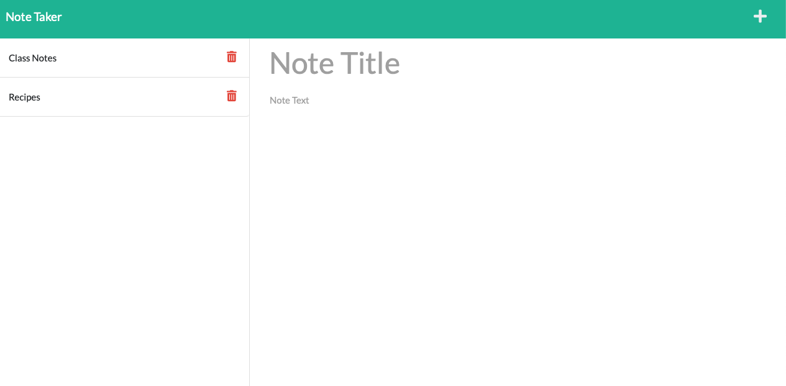

# Note-Taker-App

This is a simple application that allows the user to take notes and have them saved on a server. Please see below for more detailed steps in how the user interacts with this application.

## Accessing the application
Below are the links to the live application (.io URL) and the link to the Github Repo.

**Live URL:**  https://morning-hamlet-04510.herokuapp.com

**Github Repo:** https://github.com/bckasper/note-taker-app

## How does this application work?
**Below is a detailed breakdown of how this application works:**

1. The user opens the application using the Live URL link above (deployed on Heroku).

2. The user can enter new notes on the right hand side or navigate there by clicking the add sign in the top corner

3. Once the user has filled in both a note title and some note text, they will see a save button appear where they can save the note. This will append the note to the left sidebar.

4. The user can go back to saved notes that are stored on the server and read or edit them by clicking on the note in the left sidebar.

5. If the user wants to delete the note, they can click the trash can icon on that note and it will delete.

## Contributors
This was a solo project developed by me.

## Screenshots of note taker app
 

## Technology used in this application
1. This application was deployed with Heroku (https://dashboard.heroku.com/apps)

2. The API routing was created via Express.js (https://expressjs.com)